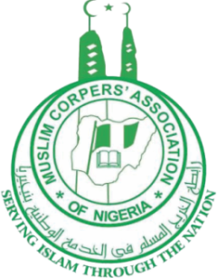

# MCAN - Muslim Corpers' Association of Nigeria



## About MCAN

The Muslim Corpers' Association of Nigeria (MCAN) is dedicated to serving and supporting Muslim youth corps members throughout their service year. We provide spiritual, moral, and social support while promoting excellence in national service and fostering Islamic brotherhood/sisterhood.

### Our Mission
To provide spiritual, moral, and social support to Muslim corps members while promoting excellence in national service and fostering Islamic brotherhood/sisterhood.

### Our Vision
To be the foremost organization supporting Muslim corps members in their spiritual growth and professional development during and after their service year.

### Our Core Values
- **Islamic Knowledge**: Promoting understanding and practice of Islam among corps members
- **Brotherhood/Sisterhood**: Fostering strong bonds and support networks among Muslim corps members
- **Service Excellence**: Encouraging exemplary service and dedication to national development
- **Professional Growth**: Supporting career development and personal growth of members

## Website Features

This website serves as the digital platform for MCAN, providing:

- **Islamic Education Programs**: Quran classes, Islamic lectures, and spiritual guidance
- **Welfare Support**: Comprehensive support services for Muslim corps members in need
- **Professional Development**: Career guidance and skill development programs
- **Community Engagement**: Islamic brotherhood/sisterhood activities and community building
- **Lodge Services**: Islamic hospitality and accommodation with halal amenities
- **Sponsorship Opportunities**: Islamic education sponsorship and mosque support programs

## Technology Stack

- **Frontend**: HTML5, CSS3, JavaScript
- **Styling**: Tailwind CSS
- **Images**: Responsive hero images with overlay navigation
- **Design**: Mobile-first responsive design
- **Hosting**: Vercel deployment ready

## Project Structure

```
mcan-fct/
├── assets/
│   └── image/
│       ├── homepage.jpg
│       ├── About MCAN Page2.jpg
│       ├── MCAN Services & Programs Page.jpg
│       ├── Projects Page.jpg
│       ├── Sponsorship Page.jpg
│       ├── Community Page2.jpg
│       ├── Contact Page.jpg
│       ├── Lodge Page.jpg
│       └── mcan-logo.png
├── landing.html          # Homepage
├── about.html            # About MCAN
├── services.html         # Programs & Services
├── projects.html         # Islamic Projects
├── sponsorship.html      # Sponsorship Opportunities
├── community.html        # Community Engagement
├── lodge.html           # Lodge Services
├── contact.html         # Contact Information
└── README.md           # Project Documentation
```

## Pages Overview

### 🏠 **Landing Page** (`landing.html`)
- Welcome message and MCAN introduction
- Core values showcase
- Islamic foundation with Quranic verse (16:162)
- Call-to-action for joining MCAN

### ℹ️ **About Page** (`about.html`)
- MCAN mission, vision, and values
- Leadership team information
- Islamic foundation and organizational history
- Quranic verse reference

### 🕌 **Services Page** (`services.html`)
- Islamic education programs
- Spiritual guidance services
- Welfare support programs
- Professional development opportunities

### 🚀 **Projects Page** (`projects.html`)
- Islamic education initiatives
- Community welfare programs
- Current and completed projects
- Social impact statistics

### 🤝 **Sponsorship Page** (`sponsorship.html`)
- Islamic education sponsorship
- Mosque and Islamic center support
- Partnership opportunities
- Sponsorship benefits and packages

### 👥 **Community Page** (`community.html`)
- Islamic brotherhood/sisterhood programs
- Community impact statistics
- Volunteer opportunities
- Community engagement activities

### 🏨 **Lodge Page** (`lodge.html`)
- Islamic hospitality services
- Halal accommodation facilities
- Prayer facilities and Islamic amenities
- Booking and contact information

### 📞 **Contact Page** (`contact.html`)
- Contact form with Islamic program options
- MCAN contact information
- Islamic resources and quick links
- Prayer times and Islamic calendar access

## Islamic Foundation

> *"Say verily, my prayer, my sacrifice, my living, and my dying are for Allah, the lord of the worlds"* - **Quran 16:162**

This sacred verse forms the foundation of our work at MCAN, reminding us that all our efforts in supporting Muslim corps members are acts of worship and service to Allah (SWT).

## Leadership Team

- **Ustadh Ahmad Ibrahim** - State Coordinator
- **Hajia Aisha Yusuf** - Deputy Coordinator  
- **Br. Abdullahi Mohammed** - General Secretary
- **Sr. Fatima Usman** - Welfare Secretary

## Getting Started

1. Clone the repository:
   ```bash
   git clone https://github.com/abdul977/mcan-fct.git
   ```

2. Navigate to the project directory:
   ```bash
   cd mcan-fct
   ```

3. Open `landing.html` in your browser or serve with a local server

4. For development, you can use any local server like:
   ```bash
   # Using Python
   python -m http.server 8000
   
   # Using Node.js
   npx serve .
   
   # Using PHP
   php -S localhost:8000
   ```

## Deployment

The website is optimized for deployment on:
- **Vercel** (recommended)
- **Netlify**
- **GitHub Pages**
- Any static hosting service

## Contributing

We welcome contributions to improve the MCAN website. Please:

1. Fork the repository
2. Create a feature branch
3. Make your changes
4. Test thoroughly
5. Submit a pull request

## Contact Information

- **Email**: info@mcan.ng, contact@mcan.ng
- **Phone**: +234 706 555 1234
- **Address**: MCAN Secretariat, Federal Capital Territory, Abuja, Nigeria

## License

© 2024 MCAN. All rights reserved.

---

**Building the future through Islamic values and community service.**
